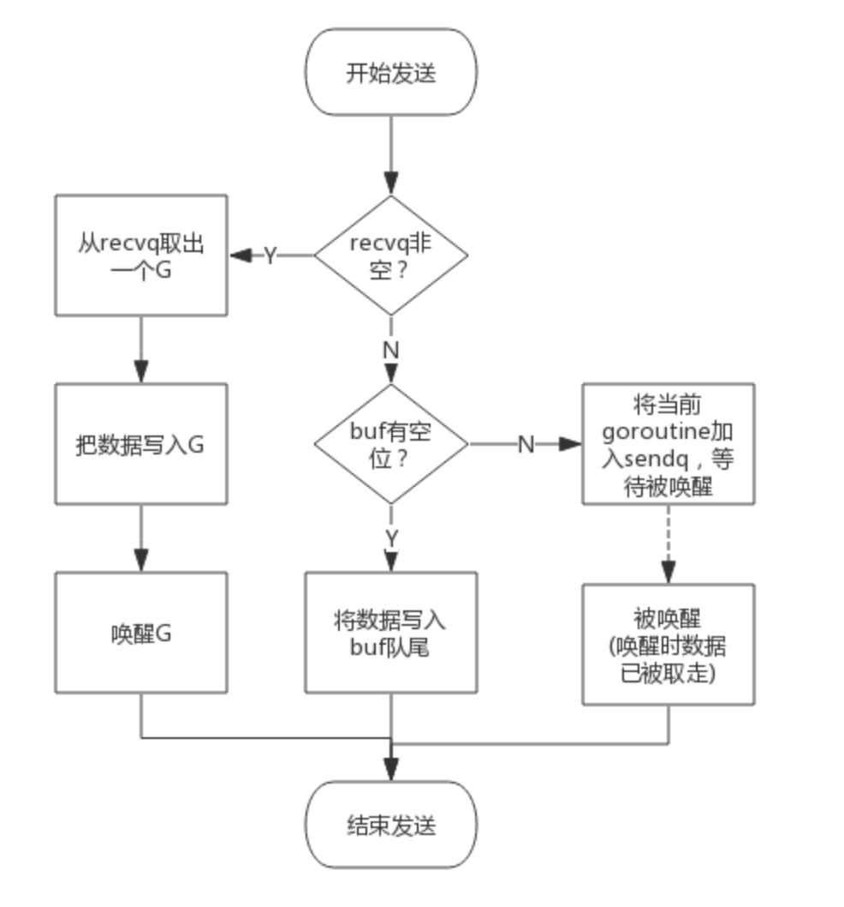
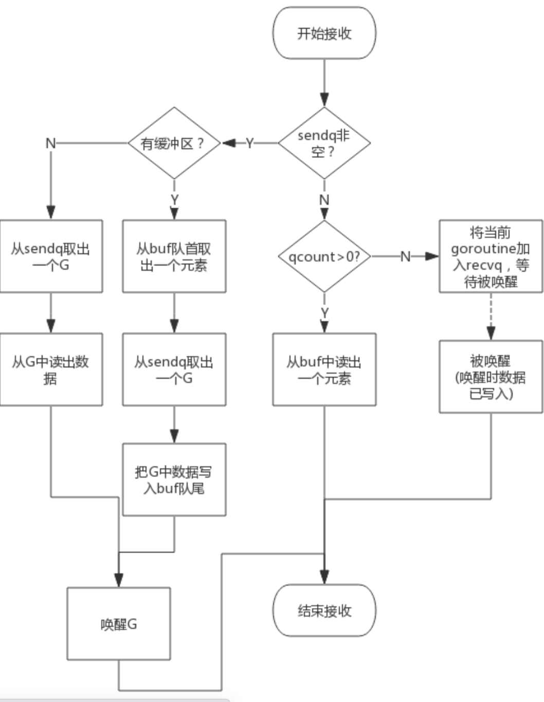

### 同步原语与锁
Go 语言在`sync`包中提供了常见的同步原语`sync.Mutex`、`sync.RWMutex`、`sync.WaitGroup`、`sync.Once`、`sync.Cond`
#### Mutex
Go 语言中的`Mutex`结构体由两个字段构成，分别是表示当前互斥锁状态的`state`字段和用于控制锁状态的信号量`sema`
```go
type Mutex struct {
	state int32
	sema  int32
}
```
**状态**
`Mutex`的`state`有32位，低3位分别代表3种状态：**饥饿状态、唤醒状态、上锁状态**，其余位表示有多少个等待锁释放的Goroutine，mutex会根据当前 state 状态来进入正常模式、饥饿模式

**正常模式**
当当前的 Goroutine 释放锁资源时，如果发现有等待唤醒的 Goroutine 队列，则会按照先进先出的顺序将队列头部的 Goroutine 唤醒。
队头的 Goroutine 被唤醒后，尝试使用 CAS 修改 state 状态，如果修改成功，则表示占有锁资源成功。

**饥饿模式**
在正常模式下，锁的等待者会按照先进先出的顺序获取锁。但是刚被唤醒的 Goroutine 与新创建的 Goroutine 竞争时，大概率是获取不到锁的，为了减少这种情况的发生，一旦 Goroutine 超过 1ms 没有获取到锁，就将锁变更为饥饿模式，防止部分 Goroutine 被饿死。
在饥饿模式下，上一个 Goroutine 释放锁后，会将锁资源直接分配给等待队列队头的 Goroutine，新来的 Goroutine 直接放到队列的尾部。
**如果一个 Goroutine 获得了互斥锁，并且他在队列的末尾或者他等待的时间小于 1ms ，那么当前的互斥锁就会切换回正常模式。**
 > 与饥饿模式相比，正常模式下的互斥锁能够提供更好地性能，饥饿模式的能避免 Goroutine 由于陷入等待无法获取锁而造成的高尾延时。

**自旋**
如果 Goroutine 占用锁资源的时间比较短，那么每次都是用信号量来唤醒 Goroutine 会浪费资源，所以在条件允许下，当前等待锁释放的 Goroutine 会自旋（空转 CPU）等待锁的释放。在空转完后再次调用 CAS 方法尝试占有锁资源，直到不满足自旋条件，最终会加入到等待队列。
自旋的条件：
- 互斥锁在正常模式下
- 运行在多 CPU 的机器上
- 自旋的次数没有超过 4 次
- p 上本地 Goroutine 队列为空 
**加锁过程**
- 如果 mutex 的 state = 0，表示没有 Goroutine 在占用锁，也没有等待唤醒的 Goroutine 队列，这时会使用 CAS 尝试修改 state 状态来获取锁。
- 如果 state != 0，则要进一步判断是否需要自旋，如果不需要自旋或者自旋后得不到资源时，就会将这个 Goroutine 加入到阻塞队列中等待唤醒。
- 当有锁资源释放时，阻塞队列头部的 Goroutine 会被唤醒，队头的 Goroutine 会尝试占有锁，此时也有可能和新来的 Goroutine 竞争锁，如果队头的 Goroutine 超过 1ms 没有获取到锁资源，互斥锁就会切换为饥饿模式，在饥饿模式下，锁资源会直接交给队头的 Goroutine ，新来的 Goroutine 也会直接加入到队列的末尾。
- 阻塞模式在阻塞队列中没有可唤醒的 Goroutine 时切换回正常模式。
**释放过程**
首先会执行快解锁，即没有等待唤醒的 Goroutine 队列，则不需要做其他事情。
如果当前是正常模式，则会简单的唤醒队列头部的 Goroutine；
如果是饥饿模式，则会直接将锁交给队头的 Goroutine 然后唤醒 Goroutine。

#### RWMutex
读写互斥锁是细粒度的互斥锁，它不限制资源的并发读，但是限制资源的并发读写和写写。
**结构体**


### channel
1. channel 是否是线程安全的？
	1. Go 语言的 channel 发送一个数据到 channel 和从 channel 中接收一个数据都是原子操作
	2. Go 的设计思想：不要通过共享内存来进行通信，要通过通信来共享内存，前者就是锁的逻辑，后者就是channel
	3. 设计 channel 的主要目的就是在多任务间传递数据，因此是安全的
2. Go channel 的底层实现
	channel 的底层是一个 hchan 结构体，在go 的 runtime 包之下
	它的数据结构如下：
	```go
	type hchan struct {
  //channel分为无缓冲和有缓冲两种。
  //对于有缓冲的channel存储数据，借助的是如下循环数组的结构
	qcount   uint           // 循环数组中的元素数量
	dataqsiz uint           // 循环数组的长度
	buf      unsafe.Pointer // 指向底层循环数组的指针
	elemsize uint16 //能够收发元素的大小
  

	closed   uint32   //channel是否关闭的标志
	elemtype *_type //channel中的元素类型
  
  //有缓冲channel内的缓冲数组会被作为一个“环型”来使用。
  //当下标超过数组容量后会回到第一个位置，所以需要有两个字段记录当前读和写的下标位置
	sendx    uint   // 下一次发送数据的下标位置
	recvx    uint   // 下一次读取数据的下标位置
  
  //当循环数组中没有数据时，收到了接收请求，那么接收数据的变量地址将会写入读等待队列
  //当循环数组中数据已满时，收到了发送请求，那么发送数据的变量地址将写入写等待队列
	recvq    waitq  // 读等待队列
	sendq    waitq  // 写等待队列


	lock mutex //互斥锁，保证读写channel时不存在并发竞争问题
}
```
hchan 结构体的主要部分有四个：
- 用于指向存储数据的循环链表缓冲区的指针--buf
- 用于存储缓冲区当前接收和发送数据的下标值--recvx，sendx
- 用于存储向该 channel 发送和接收数据的 goroutine 队列--sendq，recvq
- 保证channel写入和读取数据时线程安全的锁--lock
3. channel 的读写特性
	- 给一个 nil channel 发送数据，造成永久阻塞
	- 从一个 nil channel 接收数据，造成永久阻塞
	- 给一个已经关闭的 channel 发送数据，返回 panic
	- 从一个已经关闭的 channel 接收数据，若缓冲区为空，返回一个零值
	- 无缓冲的 channel 是同步的，有缓冲的 channel 是非同步的
4. 向 channel 发送数据的流程
	1. 如果当前 channel 的 recvq 已经有被阻塞的 Goroutine，那么直接将数据发送给当前 Goroutine，并将其设置成下一个要执行的 Goroutine;
	2. 如果 channel 存在缓冲区并且缓冲区有空闲，这时会将数据存储到 缓冲区 sendx 所指向的位置；
	3. 如果缓冲区满了，则会创建一个 sudog 结构体，并将其加入 channel 的 sendq 队列，当前 Goroutine 也会陷入阻塞并等待其他协程从 channel 中接收数据；
	
5. 从 channel 接收数据流程
		1. 如果等待发送队列 sendq 上有挂起的 Goroutine，没有缓冲区，则会将 sendq 中的 Goroutine 中将数据读出然后唤醒Goroutine；
	1. 如果等待发送队列 sendq 上有挂起的 Goroutine，说明缓冲区已经满了，这时会将 recvq 索引所在的数据拷贝到接收变量所在的内存地址，然后将 sendq 队列中的数据拷贝到缓冲区；
	2. 缓存区有数据则从缓存区中取出数据；
	3. 如果缓存区中没有数据，则将当前 goroutine 挂起，加入到 recvq 队列中，等待写 Goroutine 的唤醒。
	
### 调度器
1. Goroutine 和线程的区别
	- 创建一个 Goroutine 需要的栈内存为 2KB，在实际运行中，如果空间不够会进行扩容。创建一个线程需要消耗 1MB 的栈内存
	- Thread 的创建和销毁都会有很大的消耗，因为要涉及到与操作系统，是内核级别的，通常解决的办法就是线程池。而 Goroutine 因为是由 Go runtime 管理的，所以创建和销毁都是消耗非常小的，是用户级别的。
2. Goroutine 的调度时机有哪些？
	- 创建一个新的 goroutine 时，会考虑调度
	- 由于进行 GC 的 goroutine 也要运行在 M 上，因此发生 GC 时一定会发生调度
	- 当 goroutine 进行系统调用时，会阻塞 M，所以他会被调度走，同时一个新的 Goroutine 会被调度过来
	- 内存同步访问：atomic、mutex、channel 操作等，会使 goroutine 阻塞因此会被调度走
3. 什么是工作窃取和工作移交？
	**工作窃取**：当一个 P 发现自己的本地队列中没有可执行的 G 了，尝试从其他线程绑定的 P 上窃取它一半的 G，而不是销毁线程。
	**工作移交**：如果当前线程的G进行系统阻塞调用时，如进行`time.sleep`，则当前线程就会释放P，然后把P转交给其它空闲的线程执行，如果没有闲置的线程，则创建新的线程
4. GMP 是什么？
	G：即 goroutine 取首字母，主要保存 goroutine 的一些状态信息，以及 CPU 的一些寄存器的值
	M：代表工作线程，G 需要调度到 M 上才能运行。结构体 m 就是我们常说的 M，它保存了 M 自身使用的栈信息，当前正在运行的 G 的信息，以及与他绑定的 P 的信息等等。
	P：P 是处理器，为 M 提供上下文，保存 M 执行 G 时的一些资源，P 有一个与自己绑定的本地可运行队列，一个 M 只有绑定了一个 P 才能执行 goroutine，当 M 被阻塞时，整个 P 会传递给其他空闲的或者新建的 M。
5. 调度器的生命周期
6. 基于协作的抢占式调度原理
7. 基于信号的抢占式调度
8.  M0 和 G0
	- M0：M0 是启动程序后的编号为 0 的主线程，这个 M 对应的实例会在全局变量 runtime.m0 中，不需要在 heap 上分配，M0 负责初始化操作和启动第一个 G，在之后 M0 就和其他 M一样了。
	- G0：G0 是每次启动一个 M 都会第一个创建的 goroutine，G0 是仅负责调度的 G，G0 不指向任何可执行性的函数，每个 M 都会有自己的 G0。
9. 跟踪 fmt.Println("Hello, world")
```go
package main 
import "fmt" 
func main() {
    fmt.Println("Hello world") 
}
```
	
- 1. runtime 创建最初的线程 m0 和 g0，并将二者关联
- 2. 调度器初始化：初始化 m0、栈、垃圾回收，创建和初始化由 GOMAXPROCS 个 P 构成的 P 列表
- 3. 示例代码中的main函数是main.main，runtime中也有1个main函数——runtime.main，代码经过编译后，runtime.main会调用main.main，程序启动时会为runtime.main创建goroutine，称它为main goroutine吧，然后把main goroutine加入到P的本地队列。
- 4. 启动 m0，m0 已经绑定了 P 会从 P 的本地队列中获取 G，获取到 main goroutine
- 5. G 拥有栈，M 根据 G 中的栈信息和调度信息设置运行环境
- 6. M 运行 G
- 7. G退出，再次回到M获取可运行的G，这样重复下去，直到main.main退出，runtime.main执行Defer和Panic处理，或调用runtime.exit退出程序。