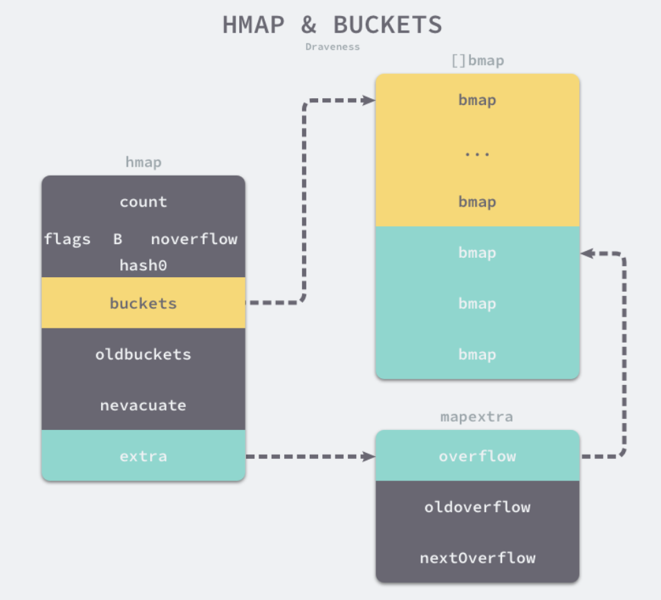

### 数组
Go 语言中数组再初始化后就无法改变了，存储元素类型相同，但是大小不同的数组再Go语言中是完全不同的，只有两个条件都相同才是同一类型。
**初始化**
数组有两种初始化方式：
```go
arr1 := [3]int{1,2,3}
arr2 := [...]int{1,2,3}
```
这两种初始化方式在运行期间得到的结果是完全相同的，第二种方式在编译期间会被转换成第一种（上限推导）
第一种方式在类型检查阶段就会被提取出来随后使用`types.NewArray()`创建包含数组大小的`types.Array`结构体。
第二种方式，编译器会在`gc.typecheckcomplit`函数中对数组的大小进行推导。

对于一个由字面量组成的数组，根据数组元素数量的不同，编译器会在负责初始化字面量的函数中做两种不同的优化：
1.  当元素数量小于或者等于 4 个时，会直接将数组中的元素放置在栈上；
2.  当元素数量大于 4 个时，会将数组中的元素放置到静态区并在运行时取出；

### 切片
**数据结构：**
切片在运行期间的数据结构是又结构体 SliceHeader 表示的：
```go
type SliceHeader strct {
	Data uintptr //指向数组的指针
	Len int //当前切片的长度
	Cap int //当前切片的容量 即Data数组的大小
}
```
Data 是一片连续的内存空间，用于存储切片中的全部元素，所以切片可以理解为一片连续的内存空间加上长度与容量的标识。
**初始化：**
```go
arr[1:3] || slice[1:3]
slice := []int{1,2,3}
slice := make([]int, 10)
```
1. 使用下标初始化切片不会拷贝原数组或者原切片中的数据，它只会创建一个指向原数组的切片结构体，所以修改新切片的数据也会修改原切片。
2. 使用字面量创建切片时：
	1. 首先会根据切片中的元素数量对底层的数组大小进行推断并创建一个数组；
	2. 将这些字面量存储到初始化的数组中；
	3. 创建一个同样指向`[3]int`类型的数组指针；
	4. 将静态存储区的数组赋值给上一步创建的指针所在的地址
	5. 通过[:]操作，获取一个底层使用的切片
3. 使用make创建切片：
	1. 检查`len`是否传入，检查传入的`len`是否比`cap`大
	2. 当切片没有发生逃逸并且切片非常小时，make([]int ,3,4)会直接转换成
			`var arr [4]int 
			`n := arr[:3]
	3. 当切片发生逃逸或者非常大时， `runtime.makeslice`会在堆上初始化切片
		> `makeSlice` 主要工作是计算切片在内存中的占用空间，并在堆上申请一片连续的内存，计算公式：内存空间=切片中元素的大小 * 切片容量，最后调用 `mallocgc` 申请内存，如果遇到比较小的对象会直接初始化在GO语言调度器的P结构中，大雨32kB的对象会在堆上初始化。

**追加**
使用`append`关键字向切片中追加元素，根据返回值是否会覆盖原变量，选择进入两种流程
1. 返回值不会覆盖原变量
```go
// append(slice, 1, 2, 3)
ptr, len, cap := slice
newlen := len + 3
if newlen > cap {
    ptr, len, cap = growslice(slice, newlen)
    newlen = len + 3
}
*(ptr+len) = 1
*(ptr+len+1) = 2
*(ptr+len+2) = 3
return makeslice(ptr, newlen, cap)
```
先解构切片得到切片的指针，大小和容量，如果追加元素后切片的大小超过了容量，则调用`growslice` 进行扩容
2. 返回值覆盖原变量
```go
// slice = append(slice, 1, 2, 3)
a := &slice
ptr, len, cap := slice
newlen := len + 3
if uint(newlen) > uint(cap) {
   newptr, len, newcap = growslice(slice, newlen)
   vardef(a)
   *a.cap = newcap
   *a.ptr = newptr
}
newlen = len + 3
*a.len = newlen
*(ptr+len) = 1
*(ptr+len+1) = 2
*(ptr+len+2) = 3
```
是否覆盖原变量的逻辑其实差不多，当我们选择覆盖原变量时，不必考虑切片发生拷贝影响性能，因为Go语言编译器已经做了优化
**扩容**
当切片容量不足时，会调用`runtime.growslice`进行扩容
```go
func growslice(et *_type, old slice, cap int) slice {
	newcap := old.cap  
	doublecap := newcap + newcap 
	if cap > doublecap {  //如果期望容量大于当前容量的二倍
		newcap = cap //新容量等于期望容量
	} else {
		if old.len < 1024 { //如果当前切片长度 < 1024
			newcap = doublecap //新容量 = 老容量 * 2
		} else { //当前切片长度大于1024
			for 0 < newcap && newcap < cap {
				newcap += newcap / 4 //每次增加25%的容量
			}
			if newcap <= 0 {
				newcap = cap
			}
		}
	}
```
扩容策略：
1. 如果期望容量大于当前容量的两倍，就使用期望容量；
2. 如果当前切片的长度小于1024就将容量翻倍；
3. 如果当前切片长度大于1024，就会每次增加25%的容量，知道新容量大于期望容量
这里的扩容仅仅是预估容量，还需要根据切片中的元素大小对齐内存，`runtime.roundupsize` 函数会将待申请的内存向上取整，取整时会使用 `runtime.class_to_size` 数组，使用该数组中的整数可以提高内存的分配效率并减少碎片

### 哈希表
**数据结构**
Go语言中map是一个指针，占用8字节，指向hmap结构体
每个map的底层结构是hmap，hmap包含了若干个结构为bmap的bucket数组。
```go
type hmap struct {
	count     int  //当前哈希表中元素数量
	flags     uint8 //状态
	B         uint8 //bucket的数量，因桶数量是2的倍数，所以len(buckets) = 2^B
	noverflow uint16
	hash0     uint32  //哈希种子

	buckets    unsafe.Pointer  //指向buckets数组的指针
	oldbuckets unsafe.Pointer //当发生扩容时，指向老的buckets的指针，老容量为新容量的1/2
	nevacuate  uintptr

	extra *mapextra
}

type mapextra struct {
	overflow    *[]*bmap
	oldoverflow *[]*bmap
	nextOverflow *bmap
}
```

如上图所示，哈希表`hmap`的桶是`bmap`。每个`bmap`能存储8个键值对，当哈希表中存储的数据过多，单个桶已经装满时，就会使用`nextOverflow`中的桶存储溢出的数据（可减少扩容频率）。
bmap的结构
在Go语言的代码中bmap结构体中只有一个字段tophash
```go
type tophash struct {
	//存储键的哈希高8位，通过比较高8位可以减少访问键值对次数提高性能
	tophash [bucketCnt] uint8 
}
```
在运行期间不止包含`tophash`这一个字段，因为哈希表中可能存储不同类型的键值对，Go语言不支持范型，所以键值对占用的空间大小只能在编译时进行推导。
```go
type bmap struct {

}
```