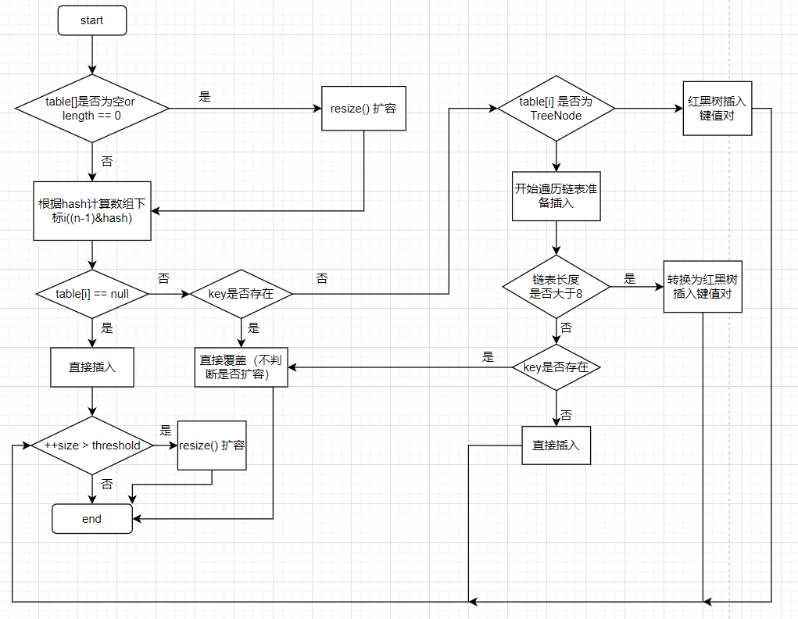

# HashMap 源码阅读

## HashMap 简介

HashMap 主要用来存放键值对，实现了基于哈希表的 Map 接口，非线程安全。

HashMap 可以存放 null 的 key 和 null 值，但 null 作为 key 只能有一个，null 作为 value 可以有多个。

HashMap 有两个版本：

- JDK8之前，HashMap 的底层数据结构为数组 + 链表，数组是 HashMap 的主体，链表则是为解决哈希冲突而存在的。
- JDK8之后，HashMap 的底层数据结构为数组 + 链表/红黑树，当链表长度大于阈值（默认是8）并且数组容量大于64时，将链表转换为红黑树，以减少搜索时间。

HashMap 的默认大小为16，之后每次扩充，容量都变为原来的2倍，并且 HashMap 总是以2的幂作为哈希表的大小

## 构造函数

```Java
	// 默认构造函数。
    public HashMap() {
        this.loadFactor = DEFAULT_LOAD_FACTOR; // all   other fields defaulted
     }

     // 包含另一个“Map”的构造函数
     public HashMap(Map<? extends K, ? extends V> m) {
         this.loadFactor = DEFAULT_LOAD_FACTOR;
         putMapEntries(m, false);//下面会分析到这个方法
     }

     // 指定“容量大小”的构造函数
     public HashMap(int initialCapacity) {
         this(initialCapacity, DEFAULT_LOAD_FACTOR);
     }

     // 指定“容量大小”和“负载因子”的构造函数
     public HashMap(int initialCapacity, float loadFactor) {
         if (initialCapacity < 0)
             throw new IllegalArgumentException("Illegal initial capacity: " + initialCapacity);
         if (initialCapacity > MAXIMUM_CAPACITY)
             initialCapacity = MAXIMUM_CAPACITY;
         if (loadFactor <= 0 || Float.isNaN(loadFactor))
             throw new IllegalArgumentException("Illegal load factor: " + loadFactor);
         this.loadFactor = loadFactor;
         this.threshold = tableSizeFor(initialCapacity);
     }
```

其中，`loadFactor`被称为负载因子，其默认大小为0.75f

> ```Java
> static final float DEFAULT_LOAD_FACTOR = 0.75f;
> ```

## 关于负载因子

在分析构造函数时，我们提到了负载因子的默认大小为0.75，所以为什么为0.75，而不是1或者0.5呢？

首先要知道 loadFactor 的作用：

loadFactor 负载因子用来控制数组存放数据的疏密程度

- 负载因子越大（越趋近于1），那么数组存放的数据也就越多，链表长度就会增加，**会导致查找开销大，效率低**。

- 负载因子越小（越趋近于0），那么数组存放的数据也就越少，存放数据很分散，**导致数组利用率低，会频繁扩容非常消耗性能**。

> loadFactor 与 threshold
>
> **threshold = capacity \* loadFactor**，**当 Size>=threshold**的时候，那么就要考虑对数组的扩增了，也就是说，这个的意思就是 **衡量数组是否需要扩增的一个标准**。

作为一般规则，默认负载因子 (.75) 在时间和空间成本之间提供了良好的折衷。较高的值会减少空间开销，但会增加查找成本（反映在 HashMap 类的大多数操作中，包括 get 和 put）。在设置其初始容量时，应考虑映射中的预期条目数及其负载因子，以尽量减少重新哈希操作的次数。如果初始容量大于最大条目数除以负载因子，则不会发生重新哈希操作。

## 方法解析

### **putMapEntries 方法：**

```Java
final void putMapEntries(Map<? extends K, ? extends V> m, boolean evict) {
    int s = m.size();
    if (s > 0) {
        // 判断table是否已经初始化
        if (table == null) { // pre-size
            // 未初始化，s为m的实际元素个数
            float ft = ((float)s / loadFactor) + 1.0F;
            int t = ((ft < (float)MAXIMUM_CAPACITY) ?
                    (int)ft : MAXIMUM_CAPACITY);
            // 计算得到的t大于阈值，则初始化阈值
            if (t > threshold)
                threshold = tableSizeFor(t);
        }
        // 已初始化，并且m元素个数大于阈值，进行扩容处理
        else if (s > threshold)
            resize();
        // 将m中的所有元素添加至HashMap中
        for (Map.Entry<? extends K, ? extends V> e : m.entrySet()) {
            K key = e.getKey();
            V value = e.getValue();
            putVal(hash(key), key, value, false, evict);
        }
    }
}
```

### put() 方法

HashMap 对外只提供put() 方法用于添加元素，put() 方法内部调用的是putVal() 方法

**putVal() 方法的流程如下：**

1. 如果定位到的数组位置没有元素就直接插入
2. 如果定位到的数组位置有元素就和要插入的 key 作比较，如果 key 相同就直接覆盖，如果 key 不同，就判断p是否为一个树节点，如果是就调用`e = ((TreeNode<K,V>)p).putTreeVal(this, tab, hash, key, value)`将元素添加进入，如果是链表节点，则遍历到链表尾部插入。

```Java
public V put(K key, V value) {
    //hash(key)：获取key的hash值，当key为null时，哈希值为0
    //key，value：要存储的键值对
    //第四个参数为onlyIfAbsent，默认是false，如果是true表示，如果不存在改key就进行put操作
    return putVal(hash(key), key, value, false, true);
}

final V putVal(int hash, K key, V value, boolean onlyIfAbsent,boolean evict) {
    Node<K,V>[] tab; Node<K,V> p; int n, i;
    // （第一次put操作）table未初始化或者长度为0，进行扩容
    //第一次resize()扩容操作后，数组容量会初始化为16
    if ((tab = table) == null || (n = tab.length) == 0)
        n = (tab = resize()).length; 
    // (n - 1) & hash 确定元素存放在哪个桶中
    // 桶为空，新生成结点放入桶中(此时，这个结点是放在数组中)
    if ((p = tab[i = (n - 1) & hash]) == null)
        tab[i] = newNode(hash, key, value, null);
    // 桶中已经存在元素
    else {
        // e为辅助节点，用来记录key值与新插入节点相同的旧节点
        Node<K,V> e; K k;
        // 比较桶中第一个元素(数组中的结点)的hash值相等，key相等
        if (p.hash == hash &&
            ((k = p.key) == key || (key != null && key.equals(k))))
                // 将第一个元素赋值给e，用e来记录
                e = p;
        // hash值相等，key不相等；
        // 为红黑树结点
        else if (p instanceof TreeNode)
            // 放入树中
            e = ((TreeNode<K,V>)p).putTreeVal(this, tab, hash, key, value);
        // 为链表结点
        else {
            // 在链表最末插入结点
            for (int binCount = 0; ; ++binCount) {
                // 到达链表的尾部
                if ((e = p.next) == null) {
                    // 在尾部插入新结点
                    p.next = newNode(hash, key, value, null);
                    // 结点数量达到阈值(默认为 8 )，执行 treeifyBin 方法
                    // 这个方法会根据 HashMap 数组来决定是否转换为红黑树。
                    // 只有当数组长度大于或者等于 64 的情况下，才会执行转换红黑树操作，以减少搜索时间。否则，就是只是对数组扩容。
                    if (binCount >= TREEIFY_THRESHOLD - 1) // -1 for 1st
                        treeifyBin(tab, hash);
                    // 跳出循环
                    break;
                }
                // 判断链表中结点的key值与插入的元素的key值是否相等
                if (e.hash == hash &&
                    ((k = e.key) == key || (key != null && key.equals(k))))
                    // 相等，跳出循环
                    break;
                // 用于遍历桶中的链表，与前面的e = p.next组合，可以遍历链表
                p = e;
            }
        }
        // 表示在桶中找到key值、hash值与插入元素相等的结点
        if (e != null) {
            // 记录e的value
            V oldValue = e.value;
            // onlyIfAbsent为false或者旧值为null
            if (!onlyIfAbsent || oldValue == null)
                //用新值替换旧值
                e.value = value;
            // 访问后回调
            afterNodeAccess(e);
            // 返回旧值
            return oldValue;
        }
    }
    // 结构性修改
    ++modCount;
    // 实际大小大于阈值则扩容
    if (++size > threshold)
        resize();
    // 插入后回调
    afterNodeInsertion(evict);
    return null;
}

```

**JDK7的 put( ) 方法**

- 如果定位到的数组位置没有元素 就直接插入。

- 如果定位到的数组位置有元素，遍历以这个元素为头结点的链表，依次和插入的 key 比较，如果 key 相同就直接覆盖，不同就采用头插法插入元素。

### get( ) 方法

```Java
public V get(Object key) {
    Node<K,V> e;
    return (e = getNode(hash(key), key)) == null ? null : e.value;
}

final Node<K,V> getNode(int hash, Object key) {
    Node<K,V>[] tab; Node<K,V> first, e; int n; K k;
    if ((tab = table) != null && (n = tab.length) > 0 &&
        (first = tab[(n - 1) & hash]) != null) {
        // 数组元素相等
        if (first.hash == hash && // always check first node
            ((k = first.key) == key || (key != null && key.equals(k))))
            return first;
        // 桶中不止一个节点
        if ((e = first.next) != null) {
            // 在树中get
            if (first instanceof TreeNode)
                return ((TreeNode<K,V>)first).getTreeNode(hash, key);
            // 在链表中get
            do {
                if (e.hash == hash &&
                    ((k = e.key) == key || (key != null && key.equals(k))))
                    return e;
            } while ((e = e.next) != null);
        }
    }
    return null;
}

```

### resize( ) 方法

进行扩容，会伴随着一次重新 hash 分配，并且会遍历 hash 表中所有的元素，是非常耗时的。在编写程序中，要尽量避免 resize。

```Java
final Node<K,V>[] resize() {
    //旧数组
    Node<K,V>[] oldTab = table;
    //旧数组容量
    int oldCap = (oldTab == null) ? 0 : oldTab.length;
    //旧数组阈值
    int oldThr = threshold;
    //新数组的容量和阈值
    int newCap, newThr = 0;
    if (oldCap > 0) {
        // 超过最大值就不再扩充了，就只好随你碰撞去吧
        // MAXIMUM_CAPACITY = 1<<30
        if (oldCap >= MAXIMUM_CAPACITY) {
            threshold = Integer.MAX_VALUE;
            return oldTab;
        }
        // 没超过最大值，容量和阈值都扩充为原来的2倍
        else if ((newCap = oldCap << 1) < MAXIMUM_CAPACITY && oldCap >= DEFAULT_INITIAL_CAPACITY)
            newThr = oldThr << 1; // double threshold
    }
    //oldCap = 0  未初始化
    //当使用new HashMap<>(int initalCapacity)时
    else if (oldThr > 0) // initial capacity was placed in threshold
        newCap = oldThr;
    else { //当使用new HashMap<>()时
        // signifies using defaults
        newCap = DEFAULT_INITIAL_CAPACITY;
        newThr = (int)(DEFAULT_LOAD_FACTOR * DEFAULT_INITIAL_CAPACITY);
    }
    // 计算新的resize上限
    if (newThr == 0) {
        float ft = (float)newCap * loadFactor;
        newThr = (newCap < MAXIMUM_CAPACITY && ft < (float)MAXIMUM_CAPACITY ? (int)ft : Integer.MAX_VALUE);
    }
    threshold = newThr;
    @SuppressWarnings({"rawtypes","unchecked"})
    Node<K,V>[] newTab = (Node<K,V>[])new Node[newCap];
    table = newTab;
    //如果为初始化数组，那么到这里已经结束
    if (oldTab != null) {
        // 把每个bucket都移动到新的buckets中
        for (int j = 0; j < oldCap; ++j) {
            Node<K,V> e;
            if ((e = oldTab[j]) != null) {
                oldTab[j] = null;
                //当该数组下标j位置只有一个元素时，直接迁移这个元素
                if (e.next == null)
                    //计算此元素在新数组的位置
                    newTab[e.hash & (newCap - 1)] = e;
                //如果e为红黑树节点
                else if (e instanceof TreeNode)
                    //红黑树节点迁移
                    ((TreeNode<K,V>)e).split(this, newTab, j, oldCap);
                else { //e为链表节点
                    Node<K,V> loHead = null, loTail = null;
                    Node<K,V> hiHead = null, hiTail = null;
                    Node<K,V> next;
                    do {
                        next = e.next;
                        // 原索引
                        // 不需要换桶
                        if ((e.hash & oldCap) == 0) {
                            if (loTail == null)
                                loHead = e;
                            else
                                loTail.next = e;
                            loTail = e;
                        }
                        // 需要换桶
                        // 新桶位置 = 旧桶位置+oldCap
                        else {
                            if (hiTail == null)
                                hiHead = e;
                            else
                                hiTail.next = e;
                            hiTail = e;
                        }
                    } while ((e = next) != null);
                    // 原索引放到bucket里
                    if (loTail != null) {
                        loTail.next = null;
                        newTab[j] = loHead;
                    }
                    // 原索引+oldCap放到bucket里
                    if (hiTail != null) {
                        hiTail.next = null;
                        newTab[j + oldCap] = hiHead;
                    }
                }
            }
        }
    }
    return newTab;
}

```

