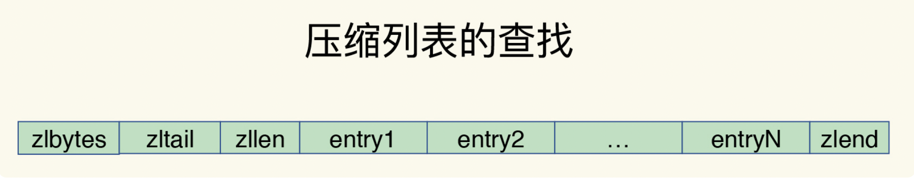

# Redis 底层数据结构

## Redis 的键和值用什么结构组织的呢？

为了实现键和值的快速访问，Redis 采用了一个哈希表来存储所有的键值对。一个哈希表就是一个数组，数组的每个元素称为一个哈希桶。哈**希桶中保存的并不是数据本身，而是指向具体值的指针**。所以不管是 String 还是集合，哈希桶的元素都是指向他们的指针。

## Redis 的 rehash操作

虽然 Redis 使用拉链法解决哈希冲突，但是随着哈希冲突越来越多，会导致拉链过长，进而导致这条链上的元素过多，增加查找耗时。所以 Redis 会对哈希表进行 rehash 操作来增加现有的哈希桶的数量。

为了使 rehash 操作更高效，redis 使用了两个全局哈希表，一开始插入数据时，只向哈希表1插入数据，对哈希表2不做操作，，随着数据不断增多，Redis 开始执行 rehash 操作，可以分为3步：

1. 给哈希表2分配更大的空间，如哈希表1的二倍。
2. 把哈希表1的数据重新映射并拷贝到哈希表2。
3. 释放哈希表1的空间，留作下一次 rehash 使用。

> **渐进式 rehash**
>
> 为了避免一次性拷贝大量数据造成 Redis 线程阻塞，Redis 采用渐进式 rehash
>
> 简单来说就是在拷贝数据时，Redis 正常处理客户端请求，每处理一个请求时，从哈希表 1 中的一个索引位置开始，顺带着将这个索引位置上的所有 entries 拷贝到哈希表 2 中；等处理下一个请求时，再顺带拷贝哈希表 1 中的下一个索引位置。

## 集合类型的底层数据结构

集合类型的底层数据结构有 5 种：整数数组、双向链表、哈希表、压缩列表和跳表。

### 压缩列表

压缩列表类似于数组，数组中的每一个元素都对应了一个数据，不过和数组不同的是，压缩列表在压缩列表的表头增加了三个字段：zlbytes、zltail和zllen。在列表的尾部增加了 zlend 字段。

> zlbytes：列表长度
>
> zltail：列表尾的偏移量
>
> zllend：列表中 entry 的数量
>
> zlend：表示列表结束

压缩列表查找列表第一个元素和最后一个元素的时间复杂度为`O(1)`，查找其他元素则为`O(N)`

### 跳表

有序链表只能逐一查找元素，导致操作起来非常缓慢，于是就出现了跳表，**跳表是在链表的基础上增加了多级索引，通过索引位置的几个跳转实现数据的快速定位。**

> 如果我们在链表中查找 33 这个元素，只能从头开始遍历这个链表，查找 6 次，直到可以找到 33 这个元素，时间复杂度为 `O(N)`。
>
> 为了提高查找速度，我们来增加一级索引：从第一个元素开始，每两个元素选一个出来作为索引。这些索引再通过指针指向原始的链表。例如，从前两个元素中抽取元素 1 作为一级索引，从第三、四个元素中抽取元素 11 作为一级索引。此时，我们只需要 4 次查找就能定位到元素 33 了。
>
> 如果我们还想再快，可以再增加二级索引：从一级索引中，再抽取部分元素作为二级索引。例如，从一级索引中抽取 1、27、100 作为二级索引，二级索引指向一级索引。这样，我们只需要 3 次查找，就能定位到元素 33 了。
>
> 可以看到，这个查找过程就是在多级索引上跳来跳去，最后定位到元素。这也正好符合“跳”表的叫法。当数据量很大时，跳表的查找复杂度就是 `O(logN)`。

## 不同操作的复杂度

## 为什么 String 类型内存开销大

String 类型除了记录实际数据外，还需要额外的内存空间记录数据长度、空间使用等信息，这些信息叫做元数据。

### 简单动态字符串 SDS （Simple Dynamic String）

当 String 类型保存的数据为字符时，String 就会用 SDS 结构体来保存数据。

>**buf**：字节数组，保存实际数据。为了表示字节数组的结束，在数组最后加上`\0`表示数组结束，占用一个字节
>
>**len：**占4个字节，表示 buf 的已用长度。
>
>**alloc：**占4个字节，表示 buf 的实际分配长度，一般大于 len

### RedisObject 结构体

redis 的数据类型有很多，而且，不同的数据类型有些相同的元数据要记录（比如说最后一次访问的时间、被引用的次数等），因此 Redis 会用一个 RedisObject 结构体来统一记录这些元数据，同时指向实际数据。

### String 类型是怎么保存数据的呢？

三种编码方式：

1. 当保存64位有符号整数时，**String 类型会把它保存为一个 8 字节的 Long 类型的整数**，这种保存方式通常叫做 int 编码方式
2. 当保存的是字符串数据，并且字符串小**于等于44字节**的时候，**RedisObject 中的元数据、指针和 SDS 是一块连续的内存区域**，这样就可以避免内存碎片。这种布局方式也被称为 embstr 编码方式。
3. 当字符串**大于 44 字节**的时候，SDS 数据量就开始变多，Redis 就不再把 RedisObject 和 SDS 放在一起了，而是**会给 SDS 分配独立的内存区域，并用指针指向 SDS 结构**。这种布局方式被称为 raw 编码模式。

